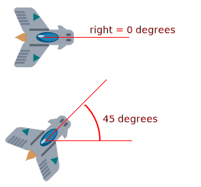

Built-in Objects
================

Pygame Zero provides useful built-in objects to help you make games easily.

.. _screen:

Screen
------

.. toctree::
    :hidden:

    ptext

The ``screen`` object represents your game screen.

It is a thin wrapper around a Pygame surface that allows you to easily
draw images to the screen ("blit" them).

.. class:: Screen

    .. attribute:: surface

        The raw `Pygame surface`_ that represents the screen buffer. You can
        use this for advanced graphics operations.

        .. _`Pygame surface`: https://www.pygame.org/docs/ref/surface.html

    .. method:: bounds()

        .. versionadded:: 1.3

        Return a ZRect representing the bounds of the screen.

    .. method:: clear()

        Reset the screen to black.

    .. method:: fill((red, green, blue))

        Fill the screen with a solid color.

    .. method:: blit(image, (left, top))

        Draw the image to the screen at the given position.

        ``blit()`` accepts either a Surface or a string as its ``image``
        parameter. If ``image`` is a ``str`` then the named image will be
        loaded from the ``images/`` directory.

    .. method:: draw.line(start, end, (r, g, b))

        Draw a line from start to end.

    .. method:: draw.circle(pos, radius, (r, g, b))

        Draw the outline of a circle.

    .. method:: draw.filled_circle(pos, radius, (r, g, b))

        Draw a filled circle.

    .. method:: draw.rect(rect, (r, g, b))

        Draw the outline of a rectangle.

        Takes a :ref:`Rect <rect>`.

    .. method:: draw.filled_rect(rect, (r, g, b))

        Draw a filled rectangle.

    .. method:: draw.text(text, [pos], **kwargs)

        Draw text.

        There's an extremely rich API for positioning and formatting text; see
        :doc:`ptext` for full details.

    .. method:: draw.textbox(text, rect, **kwargs)

        Draw text, sized to fill the given :ref:`Rect`.

        There's an extremely rich API for formatting text; see
        :doc:`ptext` for full details.

.. _rect:

Rect
----

The `Pygame Rect`_ class is available as a built in. This can be used in a
variety of ways, from detecting clicks within a region to drawing a box onto
the screen:

For example, you can draw a box with::

    RED = 200, 0, 0
    BOX = Rect((20, 20), (100, 100))

    def draw():
        screen.draw.rect(BOX, RED)

.. _`Pygame Rect`: https://www.pygame.org/docs/ref/rect.html

Resource Loading
----------------

The ``images`` and ``sounds`` objects can be used to load images and sounds
from files stored in the ``images`` and ``sounds`` subdirectories respectively.
Pygame Zero will handle loading of these resources on demand and will cache
them to avoid reloading them.

You generally need to ensure that your images are named with lowercase letters,
numbers and underscores only. They also have to start with a letter.

File names like these will work well with the resource loader::

    alien.png
    alien_hurt.png
    alien_run_7.png

These will not work::

    3.png
    3degrees.png
    my-cat.png
    sam's dog.png

Images
''''''

Pygame Zero can load images in ``.png``, ``.gif``, and ``.jpg`` formats. PNG is
recommended: it will allow high quality images with transparency.

We need to ensure an images directory is set up. If your project contains the
following files::

    space_game.py
    images/alien.png

Then ``space_game.py`` could draw the 'alien' sprite to the screen with this
code::

    def draw():
        screen.clear()
        screen.blit('alien', (10, 10))

The name passed to ``blit()`` is the name of the image file within the images
directory, without the file extension.

Or using the :ref:`actor` API, ::

    alien = Actor('alien')

    def draw():
        alien.draw()

There are some restrictions on the file names in both cases: they may only
contain lowercase latin letters, numbers and underscores. This is to prevent
compatibility problems when your game is played on a different operating system
that has different case sensitivity.

Image Surfaces
''''''''''''''

You can also load images from the ``images`` directory using the ``images``
object. This allows you to work with the image data itself, query its
dimensions and so on::

    forest = []
    for i in range(5):
        forest.append(
            Actor('tree', topleft=(images.tree.width * i, 0))
        )

Each loaded image is a Pygame ``Surface``. You will typically use
``screen.blit(...)`` to draw this to the screen. It also provides handy methods
to query the size of the image in pixels:

.. class:: Surface

    .. method:: get_width()

        Returns the width of the image in pixels.

    .. method:: get_height()

        Returns the height of the image in pixels.

    .. method:: get_size()

        Returns a tuple (width, height) indicating the size in pixels of the
        surface.

    .. method:: get_rect()

        Get a :class:`Rect` that is pre-populated with the bounds of the image
        if the image was located at the origin.

        Effectively this is equivalent to::

            Rect((0, 0), image.get_size())

Sounds
''''''

Pygame Zero can load sounds in ``.wav`` and ``.ogg`` formats. WAV is great for
small sound effects, while OGG is a compressed format that is more suited to
music. You can find free .ogg and .wav files online that can be used in your
game.

We need to ensure a sounds directory is set up. If your project contains the
following files::

    drum_kit.py
    sounds/drum.wav

Then ``drum_kit.py`` could play the drum sound whenever the mouse is clicked
with this code::

    def on_mouse_down():
        sounds.drum.play()

Each loaded sound is a Pygame ``Sound``, and has various methods to play and
stop the sound as well as query its length in seconds:

.. class:: Sound

    .. method:: play()

        Play the sound.

    .. method:: play(loops)

        Play the sound, but loop it a number of times.

        :param loops: The number of times to loop. If you pass ``-1`` as the
                      number of times to loop, the sound will loop forever (or
                      until you call :meth:`.Sound.stop()`

    .. method:: stop()

        Stop playing the sound.

    .. method:: get_length()

        Get the duration of the sound in seconds.

You should avoid using the ``sounds`` object to play longer pieces of music.
Because the sounds sytem will fully load the music into memory before playing
it, this can use a lot of memory, as well as introducing a delay while the
music is loaded.

.. _music:

Music
-----

.. versionadded:: 1.1

.. warning::

    The music API is experimental and may be subject to cross-platform
    portability issues.

    In particular:

    * MP3 may not be available on some Linux distributions.
    * Some OGG Vorbis files seem to hang Pygame with 100% CPU.

    In the case of the latter issue, the problem may be fixed by re-encoding
    (possibly with a different encoder).

A built-in object called ``music`` provides access to play music from within
a ``music/`` directory (alongside your ``images/`` and ``sounds/`` directories,
if you have them). The music system will load the track a little bit at a time
while the music plays, avoiding the problems with using ``sounds`` to play
longer tracks.

Another difference to the sounds system is that only one music track can be
playing at a time. If you play a different track, the previously playing track
will be stopped.

.. function:: music.play(name)

    Play a music track from the given file. The track will loop indefinitely.

    This replaces the currently playing track and cancels any tracks previously
    queued with ``queue()``.

    You do not need to include the extension in the track name; for example, to
    play the file ``handel.mp3`` on a loop::

        music.play('handel')

.. function:: music.play_once(name)

    Similar to ``play()``, but the music will stop after playing through once.

.. function:: music.queue(name)

    Similar to ``play_once()``, but instead of stopping the current music, the
    track will be queued to play after the current track finishes (or after
    any other previously queued tracks).

.. function:: music.stop()

    Stop the music.

.. function:: music.pause()

    Pause the music temporarily. It can be resumed by calling
    ``unpause()``.

.. function:: music.unpause()

    Unpause the music.

.. function:: music.is_playing()

    Returns True if the music is playing (and is not paused), False otherwise.

.. function:: music.fadeout(duration)

    Fade out and eventually stop the current music playback.

    :param duration: The duration in seconds over which the sound will be faded
                    out. For example, to fade out over half a second, call
                    ``music.fadeout(0.5)``.

.. function:: music.set_volume(volume)

    Set the volume of the music system.

    This takes a number between 0 (meaning silent) and 1 (meaning full volume).

.. function:: music.get_volume()

    Get the current volume of the music system.

If you have started a music track playing using :func:`music.play_once()`, you
can use the :func:`on_music_end() hook <on_music_end>` to do something when the
music ends - for example, to pick another track at random.

.. _clock:

Clock
-----

Often when writing a game, you will want to schedule some game event to occur
at a later time. For example, we may want a big boss alien to appear after 60
seconds. Or perhaps a power-up will appear every 20 seconds.

More subtle are the situations when you want to delay some action for a shorter
period. For example you might have a laser weapon that takes 1 second to charge
up.

We can use the ``clock`` object to schedule a function to happen in the
future.

Let's start by defining a function ``fire_laser`` that we want to run in the
future::

    def fire_laser():
        lasers.append(player.pos)

Then when the fire button is pressed, we will ask the ``clock`` to call it for
us after exactly 1 second::

    def on_mouse_down():
        clock.schedule(fire_laser, 1.0)

Note that ``fire_laser`` is the function itself; without parentheses, it is
not being called here! The clock will call it for us.

(It is a good habit to write out times in seconds with a decimal point, like
``1.0``. This makes it more obvious when you are reading it back, that you are
referring to a time value and not a count of things.)

``clock`` provides the following useful methods:

.. class:: Clock

    .. method:: schedule(callback, delay)

        Schedule `callback` to be called after the given delay.

        Repeated calls will schedule the callback repeatedly.

        :param callback: A callable that takes no arguments.
        :param delay: The delay, in seconds, before the function should be
                      called.

    .. method:: schedule_unique(callback, delay)

        Schedule `callback` to be called once after the given delay.

        If `callback` was already scheduled, cancel and reschedule it. This
        applies also if it was scheduled multiple times: after calling
        ``schedule_unique``, it will be scheduled exactly once.

        :param callback: A callable that takes no arguments.
        :param delay: The delay, in seconds, before the function should be
                      called.

    .. method:: schedule_interval(callback, interval)

        Schedule `callback` to be called repeatedly.

        :param callback: A callable that takes no arguments.
        :param interval: The interval in seconds between calls to `callback`.

    .. method:: unschedule(callback)

        Unschedule callback if it has been previously scheduled (either because
        it has been scheduled with ``schedule()`` and has not yet been called,
        or because it has been scheduled to repeat with
        ``schedule_interval()``.

Note that the Pygame Zero clock only holds weak references to each callback
you give it. It will not fire scheduled events if the objects and methods are
not referenced elsewhere. This can help prevent the clock keeping objects
alive and continuing to fire unexpectedly after they are otherwise dead.

The downside to the weak references is that you won't be able to schedule
lambdas or any other object that has been created purely to be scheduled. You
will have to keep a reference to the object.

.. _actor:

Actors
------

Once you have many images moving around in a game it can be convenient to have
something that holds in one place the image and where it is on screen. We'll
call each moving image on screen an ``Actor``. You can create an actor by supplying
at least an image name (from the images folder above). To draw the alien talked
about above::

    alien = Actor('alien', (50, 50))

    def draw():
        screen.clear()
        alien.draw()

You can move the actor around by setting its pos attribute in an update::

    def update():
        if keyboard.left:
            alien.x -= 1
        elif keyboard.right:
            alien.x += 1

And you may change the image used to draw the actor by setting its image
attribute to some new image name::

    alien.image = 'alien_hurt'

Actors have all the same attributes and methods as :ref:`Rect <rect>`,
including methods like `.colliderect()`__ which can be used to test whether
two actors have collided.

.. __: https://www.pygame.org/docs/ref/rect.html#pygame.Rect.colliderect

Positioning Actors
''''''''''''''''''

If you assign a new value to one of the position attributes then the actor will
be moved. For example::

    alien.right = WIDTH

will position the alien so its right-hand side is set to ``WIDTH``.

Similarly, you can also set the initial position of the actor in the
constructor, by passing one of these as a keyword argument: ``pos``,
``topleft``, ``topright``, ``bottomleft``, ``bottomright``, ``midtop``,
``midleft``, ``midright``, ``midbottom`` or ``center``:

.. image:: _static/actor/anchor_points.png

This can be done during creation or by assigning a pair of x, y co-ordinates.
For example::

    WIDTH = 200
    HEIGHT = 200

    alien = Actor('alien', center=(100,100))

    def draw():
        screen.clear()
        alien.draw()

.. image:: _static/actor/alien_center.png

Changing ``center=(100, 100)`` to ``midbottom=(100, 200)`` gives you:

.. image:: _static/actor/alien_midbottom.png

If you don't specify an initial position, the actor will initially be
positioned in the top-left corner (equivalent to ``topleft=(0, 0)``).

.. _anchor:

Anchor point
''''''''''''

Actors have an "anchor position", which is a convenient way to position the
actor in the scene. By default, the anchor position is the center, so the
``.pos`` attribute refers to the center of the actor (and so do the ``x`` and
``y`` coordinates). It's common to want to set the anchor point to another
part of the sprite (perhaps the feet - so that you can easily set the Actor to
be "standing on" something)::

    alien = Actor('alien', anchor=('center', 'bottom'))
    spaceship = Actor('spaceship', anchor=(10, 50))

``anchor`` is specified as a tuple ``(xanchor, yanchor)``, where the values can
be floats or the strings ``left``, ``center``/``middle``, ``right``, ``top`` or
``bottom`` as appropriate.

.. _rotation:

Rotation
''''''''

.. versionadded:: 1.2

The ``.angle`` attribute of an Actor controls the rotation of the sprite, in
degrees, anticlockwise (counterclockwise).

The centre of rotation is the Actor's :ref:`anchor point <anchor>`.

Note that this will change the ``width`` and ``height`` of the Actor.

For example, to make an asteroid sprite spinning slowly anticlockwise in
space::

    asteroid = Actor('asteroid', center=(300, 300))

    def update():
        asteroid.angle += 1

To have it spin clockwise, we'd change ``update()`` to::

    def update():
        asteroid.angle -= 1

As a different example, we could make an actor ``ship`` always face the mouse
pointer. Because :meth:`~Actor.angle_to()` returns 0 for "right", the sprite we
use for "ship" should face right::

    ship = Actor('ship')

    def on_mouse_move(pos):
        ship.angle = ship.angle_to(pos)

Remember that angles loop round, so 0 degrees == 360 degrees == 720 degrees.
Likewise -180 degrees == 180 degrees.

Distance and angle to
'''''''''''''''''''''

Actors have convenient methods for calculating their distance or angle to other
Actors or ``(x, y)`` coordinate pairs.

.. method:: Actor.distance_to(target)

    Return the distance from this actor's position to target, in pixels.

.. method:: Actor.angle_to(target)

    Return the angle from this actor's position to target, in degrees.

    This will return a number between -180 and 180 degrees. Right is 0 degrees
    and the angles increase going anticlockwise.

    Therefore:

    * Left is 180 degrees.
    * Up is 90 degrees.
    * Down is -90 degrees.

The Keyboard
------------

You probably noticed that we used the ``keyboard`` in the above code.
If you'd like to know what keys are pressed on the keyboard, you can query the
attributes of the ``keyboard`` builtin. If, say, the left arrow is held down,
then ``keyboard.left`` will be ``True``, otherwise it will be ``False``.

There are attributes for every key; some examples::

    keyboard.a  # The 'A' key
    keyboard.left  # The left arrow key
    keyboard.rshift  # The right shift key
    keyboard.kp0  # The '0' key on the keypad
    keyboard.k_0  # The main '0' key

The full set of key constants is given in the `Buttons and Keys`_
documentation, but the attributes are lowercase, because these are variables
not constants.

.. deprecated:: 1.1

    Uppercase and prefixed attribute names (eg. ``keyboard.LEFT`` or
    ``keyboard.K_a``) are now deprecated; use lowercase attribute names
    instead.

.. _`Buttons and Keys`: hooks.html#buttons-and-keys

.. versionadded:: 1.1

    You can now also query the state of the keys using the keyboard constants
    themselves::

        keyboard[keys.A]  # True if the 'A' key is pressed
        keyboard[keys.SPACE]  # True if the space bar is pressed

Animations
----------

You can animate most things in pygame using the builtin ``animate()``. For
example, to move an :ref:`Actor <actor>` from its current position on the
screen to the position ``(100, 100)``::

    animate(alien, pos=(100, 100))

.. function:: animate(object, tween='linear', duration=1, on_finished=None, **targets)

    Animate the attributes on object from their current value to that
    specified in the targets keywords.

    :param tween: The type of *tweening* to use.
    :param duration: The duration of the animation, in seconds.
    :param on_finished: Function called when the animation finishes.
    :param targets: The target values for the attributes to animate.

The tween argument can be one of the following:

+--------------------+------------------------------------------------------+
| 'linear'           | Animate at a constant speed from start to finish     |
+--------------------+------------------------------------------------------+
| 'accelerate'       | Start slower and accelerate to finish                |
+--------------------+------------------------------------------------------+
| 'decelerate'       | Start fast and decelerate to finish                  |
+--------------------+------------------------------------------------------+
| 'accel_decel'      | Accelerate to mid point and decelerate to finish     |
+--------------------+------------------------------------------------------+
| 'in_elastic'       | Give a little wobble at the end                      |
+--------------------+------------------------------------------------------+
| 'out_elastic'      | Have a little wobble at the start                    |
+--------------------+------------------------------------------------------+
| 'in_out_elastic'   | Have a wobble at both ends                           |
+--------------------+------------------------------------------------------+
| 'bounce_end'       | Accelerate to the finish and bounce there            |
+--------------------+------------------------------------------------------+
| 'bounce_start'     | Bounce at the start                                  |
+--------------------+------------------------------------------------------+
| 'bounce_start_end' | Bounce at both ends                                  |
+--------------------+------------------------------------------------------+

The ``animate()`` function returns an ``Animation`` instance:

.. class:: Animation

    .. method:: stop(complete=False)

        Stop the animation, optionally completing the transition to the final
        property values.

        :param complete: Set the animated attribute to the target value.

    .. attribute:: running

        This will be True if the animation is running. It will be False
        when the duration has run or the ``stop()`` method was called before
        then.

    .. attribute:: on_finished

        You may set this attribute to a function which will be called
        when the animation duration runs out. The ``on_finished`` argument
        to ``animate()`` also sets this attribute. It is not called when
        ``stop()`` is called. This function takes no arguments.

Tone Generator
--------------

.. versionadded:: 1.2

Pygame Zero can play tones using a built-in synthesizer.

.. function:: tone.play(pitch, duration)

    Play a note at the given pitch for the given duration.

    Duration is in seconds.

    The `pitch` can be specified as a number in which case it is the frequency
    of the note in hertz.

    Alternatively, the pitch can be specified as a string representing a note
    name and octave. For example:

    * ``'E4'`` would be E in octave 4.
    * ``'A#5'`` would be A-sharp in octave 5.
    * ``'Bb3'`` would be B-flat in octave 3.

Creating notes, particularly long notes, takes time - up to several
milliseconds. You can create your notes ahead of time so that this doesn't slow
your game down while it is running:

.. function:: tone.create(pitch, duration)

    Create and return a Sound object.

    The arguments are as for play(), above.

This could be used in a Pygame Zero program like this::

    beep = tone.create('A3', 0.5)

    def on_mouse_down():
        beep.play()
