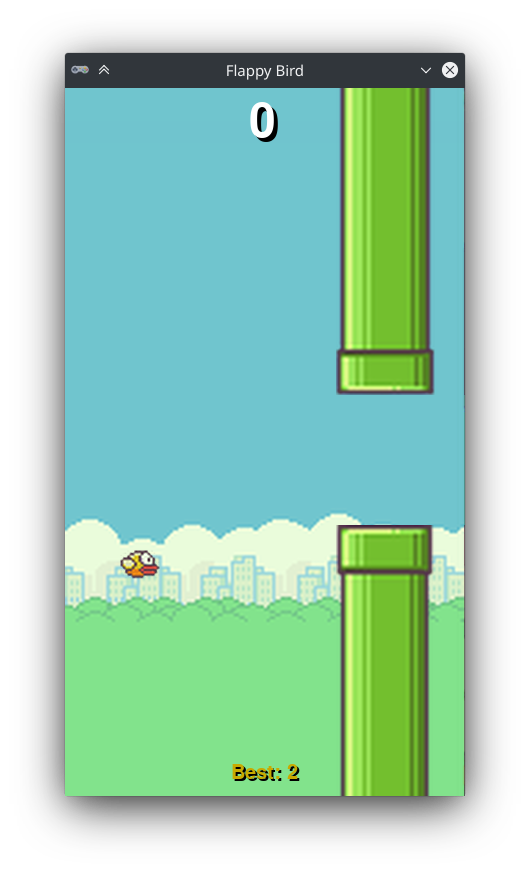

Examples
========
Pygame Zero has a collection of examples which you can use to learn by reading
or modifying the code of the game. You can also play with them! These examples 
aren't provided with a normal installation of Pygame Zero but they're available
in the source code repository. To download them, follow the following steps:

- Download the source code of Pygame Zero on the 
  `GitHub repository <https://github.com/lordmauve/pgzero>`_ by clicking in the
  big green button and choosing **Download ZIP**
- Copy the ``examples`` folder whatever you want.
- Delete the ZIP and the source code if you want to save space on your disk.

Now you can play with them as another game that you might created. For example,
to run the pong game, you should run::

    pgzrun examples/pong/pong.py

Reading & editing the source code is a great way to learn to code, so start
hacking the code!

List of example games
---------------------

Asteroids
^^^^^^^^^

To play, run::

    pgzrun examples/asteroids/main.py

Basic
^^^^^
This a collection of simple examples that you can use to learn who to use key
parts of Pygame Zero. Some of them are examples explained in the documentation.

Flappybird
^^^^^^^^^^

To play, run::

    pgzrun examples/flappybird/flappybird.py

Lander
^^^^^^

   
To play, run::

    pgzrun examples/lander/lander.py

Memory
^^^^^^
.. image:: _static/memory.png
   :alt: Memory
   :height: 500
   :align: center
   
To play, run::

    pgzrun examples/memory/memory.py

Mines
^^^^^
.. image:: _static/mines.png
   :alt: Mines
   :height: 300
   :align: center
   
To play, run::

    pgzrun examples/mines/mines.py

Pong
^^^^
.. image:: _static/pong.png
   :alt: Pong
   :height: 500
   :align: center
   
To play, run::

    pgzrun examples/pong/pong.py

Snake
^^^^^

   
To play, run::

    pgzrun examples/snake/snake.py

Tetra puzzle
^^^^^^^^^^^^

   
To play, run::

    pgzrun examples/tetra_puzzle/main.py

Tron
^^^^

   
To play, run::

    pgzrun examples/tron/tron.py
