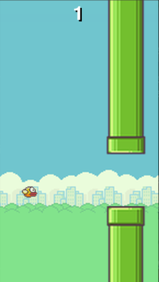

Flappy Bird
===========

Flappy Bird was a short-lived but intensely popular mobile game from 2013. Its
appeal stems from its simplicity but punishing difficulty.

In this course we will create a simple clone of Flappy Bird. You will need a
little familiarity with basic Python concepts. It will take approximately two
hours.

This tutorial will assume you are comfortable editing and saving text files,
and running commands at the command line.

Target state
------------

The flappy bird game we will create looks like this:

Pressing any key will cause the bird to flap upwards. Otherwise it will drop
under gravity. The bird needs to be steered through a course of pipes.

There is an example of Flappy Bird in the ``examples/flappybird/`` directory
within the Pygame Zero distribution. You might like to try out the game if you
are not familiar with it.

Decomposing the problem
-----------------------

There are several features we need to implement in order to create Flappy Bird:

* The screen needs to scroll through a sequence of pipes at different, random
  heights.
* The bird needs to fall under gravity and flap when the space bar is pressed.
* We need to detect collisions between the bird and the pipe. If the bird
  collides with a pipe then the bird dies and drops off the screen.
* We need to show a score that increases whenever the bird successfully
  navigates a pipe.

One thing we can do to make this game a little easier to write is to fake the
scrolling of the screen. Rather than scrolling the screen, and having the
screen follow the bird, we can simply move the bird up and down in place and
move the pipes towards the bird.

Setting up the game
-------------------

Start a new file, and without adding any contents, save it as
``flappybird.py``.

Check that this runs by typing ``pgzrun flappybird.py`` at the command line.

Assuming Pygame Zero was installed correctly, and you're in the right
directory, then you should see a black window appear with the title "Pygame
Zero Game". It doesn't look like much but this is a useful sanity check!

Finding images
--------------

To start with, find the images for the game. Images for Flappy Bird are
included in the ``examples/flappybird/images/`` directory within the Pygame
Zero distribution, but you could also draw images or find them online.

Let's go through the images we will use.

First of all, there's a background.

.. image:: _static/flappybird/background.png

There's a set of images for the bird - some with flapping wings, and another
to indicate that the bird is dead:

+----------------------------------------------+-----------------------+
| Image                                        | Filename              |
+==============================================+=======================+
| .. image:: _static/flappybird/bird0.png      | ``bird0.png``         |
+----------------------------------------------+-----------------------+
| .. image:: _static/flappybird/bird1.png      | ``bird1.png``         |
+----------------------------------------------+-----------------------+
| .. image:: _static/flappybird/bird2.png      | ``bird2.png``         |
+----------------------------------------------+-----------------------+
| .. image:: _static/flappybird/birddead.png   | ``birddead.png``      |
+----------------------------------------------+-----------------------+

Paint the background
--------------------
