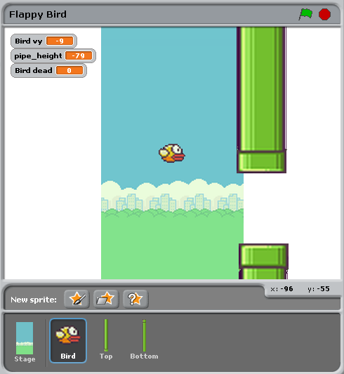
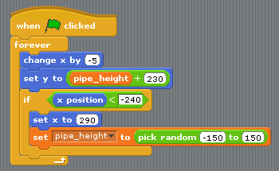
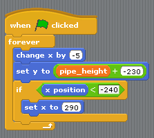
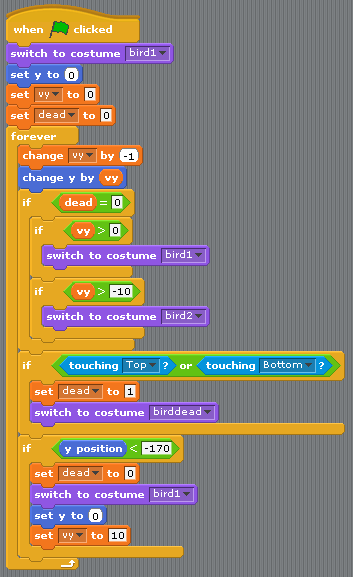
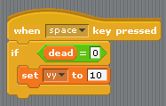

Migrating from Scratch
======================

This tutorial will compare an implementation of Flappy Bird written in Scratch
with one written in Pygame Zero. The Scratch and Pygame Zero programs are
similar to a remarkable extent.

The `Pygame Zero version`__ can be found in Pygame Zero repository.

.. __: https://github.com/lordmauve/pgzero/blob/master/examples/flappybird/flappybird.py

You can also download the `Scratch version`__ from the repository.

.. __: https://github.com/lordmauve/pgzero/raw/master/examples/flappybird/Flappy%20Bird.sb

The Pygame Zero version includes scoring logic, which is omitted in the code
examples on this page to make it a closer comparison.

The Python code shown below is re-arranged for clarity within the examples.

The stage
---------

Here's how the stage is laid out in our Scratch program:

There are just three objects, aside from the background: the bird, and the top
and bottom pipes.

This corresponds to the Pygame Zero code setting these objects up as
``Actors``::

   bird = Actor('bird1', (75, 200))
   pipe_top = Actor('top', anchor=('left', 'bottom'))
   pipe_bottom = Actor('bottom', anchor=('left', 'top'))

In Pygame Zero we also have to ensure we draw these objects. In principle this
gives a little more flexibility about how to draw the scene::

   def draw():
       screen.blit('background', (0, 0))
       pipe_top.draw()
       pipe_bottom.draw()
       bird.draw()

Pipe movement
-------------

The pipes move at a constant rate irrespective of the bird. When they move off
the left-hand side of the screen, they loop around to the right, and their
vertical position moves at random.

In Scratch this can be achieved by creating two different scripts for the top
and bottom pipe.

To summarise what's happening here:

* The condition ``x position < -240`` is true when a pipe is off the left-hand
  side of the screen, and this is the trigger to reset the pipes.
* The ``pipe_height`` variable is used to coordinate the two pipes. Because the
  gap between them should remain the same, we can't pick *both* heights
  randomly. Therefore one of the scripts has this logic and the other doesn't.
* The ``set y position to pipe height +/- 230`` sets one pipe to be above
  ``pipe_height`` and the other pipe below ``pipe_height``.

This code becomes much simpler in Pygame Zero. We could write a single function
that updates both pipes. In fact I split it a different way to make it clear
that the reset actions go together::

   import random

   WIDTH = 400
   HEIGHT = 708
   GAP = 130
   SPEED = 3

   def reset_pipes():
       pipe_gap_y = random.randint(200, HEIGHT - 200)
       pipe_top.pos = (WIDTH, pipe_gap_y - GAP // 2)
       pipe_bottom.pos = (WIDTH, pipe_gap_y + GAP // 2)

   def update_pipes():
       pipe_top.left -= SPEED
       pipe_bottom.left -= SPEED
       if pipe_top.right < 0:
           reset_pipes()

A small difference here is that I can extract values that I want to re-use as
"constants", spelled in UPPERCASE. This lets me change them in one place when I
want to tune the game. For example, in the code above, I could widen or narrow
the gap between the two pipes simply by changing ``GAP``.

The biggest thing that differs is that there is no ``forever`` loop in Python
code.  This is the big difference between Scratch and most text-based
programming languages: you must update the game by one animation step and then
return.  Returning gives Pygame Zero a chance to do things like processing
input or redrawing the screen. Loop forever and the game would just sit there,
so any loops need to finish quickly.

Pygame Zero calls an ``update()`` function when it wants you to update the
animation by one step, so we just need to a call to ``update_walls()``::

   def update():
      update_walls()

The Bird
--------

The patterns described above for how Scratch logic translates to Python code
also apply for the bird logic. Let's look at the Python code first this time.

The code to update the bird is organised into a function called
``update_bird()``. The first thing this function contains is some code to move
the bird according to gravity::

   GRAVITY = 0.3

   # Initial state of the bird
   bird.dead = False
   bird.vy = 0

   def update_bird():
       uy = bird.vy
       bird.vy += GRAVITY
       bird.y += bird.vy
       bird.x = 75

This is a simple gravity formula:

* Gravity means constant **acceleration downwards**.
* Acceleration is change in **velocity**.
* Velocity is change in **position**.

To represent this we need to track a variable ``bird.vy``, which is the bird's
velocity in the ``y`` direction. This is a new variable that we are defining,
not something that Pygame Zero provides for us.

* Gravity means constant acceleration downwards: ``GRAVITY`` is greater than 0.
* Acceleration is change in velocity: ``GRAVITY`` gets added to ``bird.vy``
* Velocity is change in position: ``bird.vy`` gets added to ``bird.y``

Note that the bird does not move horizontally! Its ``x`` position stays at
75 through the whole game. We simulate movement by moving the pipes towards
it. This looks as though it's a moving camera following the bird. So there's
no need for a ``vx`` variable in this game.

The next section makes the bird flap its wings::

       if not bird.dead:
           if bird.vy < -3:
               bird.image = 'bird2'
           else:
               bird.image = 'bird1'

This checks if the bird is moving upwards or downwards. We show the ``bird2``
image if it is moving upwards fast and the ``bird1`` image otherwise. (-3 was
picked by trial and error to make this look convincing).

The next section checks if the bird has collided with a wall::

       if bird.colliderect(pipe_top) or bird.colliderect(pipe_bottom):
           bird.dead = True
           bird.image = 'birddead'

If so we set ``bird.dead`` to ``True``. This is a **boolean value** meaning it
is either ``True`` or ``False``. We can use this to easily check if the bird is
alive. If it isn't alive it won't respond to player input.

And the final section checks if the bird has fallen off the bottom (or the top)
of the game screen. If so it resets the bird::

       if not 0 < bird.y < 720:
           bird.y = 200
           bird.dead = False
           bird.vy = 0
           reset_pipes()

What's ``reset_pipes()`` doing there? Because I'd organised my pipes code to
be a separate function, I can just call it whenever I want to reset my walls.
In this case it makes it a better game because it gives the player a chance to
react when the bird moves back to its start position.

Again, this needs to be called every frame, so we add it to ``update()``::

   def update():
      update_walls()
      update_bird()

The final part of the bird logic is that it has to respond to player control.
When we press a key, the bird flaps upwards. Pygame Zero will call an
``on_key_down()`` function - if you've defined one - whenever a key is
pressed::

   FLAP_VELOCITY = -6.5

   def on_key_down():
       if not bird.dead:
           bird.vy = FLAP_VELOCITY

Here, if the bird is not dead, we set its ``vy`` to a negative number: in
Pygame Zero this means it starts moving upwards.

You should be able to find a lot of parallels between the Python code and this
Scratch code:

The biggest differences between Scratch and Pygame Zero are these:

* You cannot loop forever in Pygame Zero - just update for one frame and then
  return.
* The coordinates are different. In Pygame Zero, the top left of the screen is
  ``x = 0, y = 0``. The ``x`` direction goes from left to right as before, but
  ``y`` goes down the screen! This is why ``GRAVITY`` is a positive number and
  ``FLAP_VELOCITY`` is a negative number in Python.
* ``bird.dead`` is a bool, so I can write code like ``if not bird.dead``
  instead of ``dead = 0`` as in Scratch.

Summary
-------

Many of the concepts available in Scratch can be translated directly into
Pygame Zero.

Here are some comparisons:

+----------------------------+--------------------------------------------+
| In Scratch                 | In Pygame Zero                             |
+============================+============================================+
| ``change y by 1`` (up)     | ``bird.y -= 1``                            |
+----------------------------+--------------------------------------------+
| ``change y by -1`` (down)  | ``bird.y += 1``                            |
+----------------------------+--------------------------------------------+
| ``set costume to <name>``  | ``bird.image = 'name'``                    |
+----------------------------+--------------------------------------------+
| ``if dead = 0``            | ``if not bird.dead:``                      |
+----------------------------+--------------------------------------------+
| ``set dead to 0``          | ``bird.dead = False``                      |
+----------------------------+--------------------------------------------+
| ``if touching Top?``       | ``if bird.colliderect(pipe_top)``          |
+----------------------------+--------------------------------------------+
| ``When Flag clicked``...   | Put code into the ``update()`` function.   |
| ``forever``                |                                            |
+----------------------------+--------------------------------------------+
| ``When [any] key pressed`` | ``def on_key_down():``                     |
+----------------------------+--------------------------------------------+
| ``pick random a to b``     | ``import random`` to load the ``random``   |
|                            | module, then ``random.randint(a, b)``      |
+----------------------------+--------------------------------------------+
| (0, 0) is the centre of    | (0, 0) is the top-left of the window       |
| the stage                  |                                            |
+----------------------------+--------------------------------------------+

In some cases, the code is simpler in Python because it can be
organised in a way that helps it make sense when you read it.

The power of Pygame Zero's actors also makes the coordinate manipulation
easier. We used the ``anchor`` position to position the pipes, and we were able
to see if a pipe was off-screen by checking ``pipe_top.right < 0`` rather than
``if x position < -240``.
