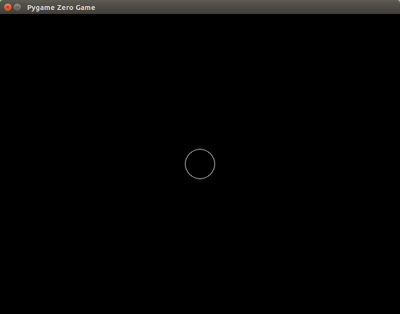

Learn programming with Pygame Zero
==================================

Let's start at the beginning. This tutorial is for those with no programming
experience whatsoever. We're going to learn to make a simple but perhaps fun
game.

I'm going to assume Pygame Zero is installed already and you know how to use
a text editor.

Creating a blank file
=====================

First, create an empty file called "fishfrenzy.py" by creating a new, empty
file in your editor and saving it as "fishfrenzy.py" in a new directory.

Verify that this runs and creates a blank window by running ::

    cd the_directory_you_created
    pgzrun fishfrenzy.py

How you run this may depend on your editor, shell, or loads of other things.

If this step failed, then you may be in the wrong directory, or Python or
Pygame Zero may not be installed correctly - or hundreds of other things. In
many ways this is the hardest step, because it's beyond the scope of this
tutorial to explain things, given how many different configurations there are:
what operating system you are running, what version of Python, what version of
Pygame Zero.

But with any luck you can get it to work! If you see a blank "Pygame Zero Game"
window, we're good to move on.

Really stuck?
-------------

You can get into a support chat room by going to

http://webchat.freenode.net?randomnick=1&channels=%23%23learnpython&uio=d4

Functions
=========

Let's begin for real.

In most programming languages we program by defining a series of steps that the
computer will carry out for us, like a **recipe**. In bakery, you might have
a recipe like:

    **Cake Recipe**

    * Add flour to the bowl
    * Add sugar to the bowl
    * Add butter to the bowl
    * Add an egg to the bowl
    * Whisk the ingredients
    * Pour into a cake tin
    * Bake it

... and so on. (Don't try this recipe. I am not a chef.)

A game among programmers is to imagine how this would look as a program in an
imaginary computer that understood whatever instructions you could name (this
is called **pseudocode** - because it looks like code, but it doesn't actually
work). If we translated this recipe into Python, it would look like this::

    def cake_recipe():
        bowl.add(flour)
        bowl.add(sugar)
        bowl.add(butter)
        bowl.add(egg)
        whisk(bowl)
        cake_tin.add(bowl.get_contents())
        bake(cake_tin)

That's pretty similar, isn't it? We've had to spell the names of some of the
words differently, but basically, each line of the program is equivalent to one
line of the recipe - one "action".

The top line with ``def`` is defining a recipe called ``cake_recipe``, and all
of the other lines are steps in the recipe. And in fact - because they all use
parentheses - they refer to other recipes that the computer might know.

So, let's write a real recipe in Pygame Zero. In your editor, let's write a
``draw`` recipe. Pygame Zero knows how to call a function called ``draw``::

    def draw():
        screen.clear()
        screen.draw.circle((400, 300), 30, (255, 255, 255))

Run it with::

    pgzrun fishfrenzy.py

Did it work? Do you see the circle? On my screen it looks like this:

If Pygame Zero didn't show a window, or showed a window that disappeared
straight away, look at the error message it displayed:

* ``SyntaxError`` - Probably means you are missing a parenthesis or your
  indentation doesn't match mine. Note how each step of the function has to be
  aligned with each other, but indented **more** than the ``def`` at the top.
* ``AttributeError`` or ``NameError`` - You probably mispelled something.
* ``TypeError`` - did you put some of the parentheses in the wrong places?

If the window appears, but nothing happens, did you misspell "draw"? Or any of
the numbers?

Check carefully if it doesn't work first time and you should be able to get it
to work after a few attempts.

So we created a recipe that includes two steps:

1. Clear the screen to black
2. Draw a circle on the screen:

    * At the middle ``(400, 300)``. These are coordinates for the center of the
      circle, in pixels from the left then pixels from the top.
    * Of radius ``30`` pixels.
    * And draw it in white, which is written as three numbers, red, green and
      blue: ``(255, 255, 255)``. White is an equal mix of red, green and blue,
      and ``255`` is the most you can have.

You can play with all of these numbers.

Diversion: Local and Global Variables
-------------------------------------

Suppose we wrote the following code::

    RED = 150, 0, 0
    GREEN = 0, 128, 0

    bg = RED

    def draw():
        screen.fill(bg)

    def on_mouse_down():
        bg = GREEN

    def on_mouse_up():
        bg = RED

In some languages, this would work: the screen would change to green
when the mouse button was pressed, and change back to red when the button is
released.

This code doesn't work in Python. If you try it, you will not see the screen
change to green. Why?

When you assign with the ``=`` operator inside a function, as at line 10 (and
line 13), you create a "local" variable called ``bg`` that exists only with the
function. The ``bg`` we want to change is in the global scope. It's actually
a very sensible feature; you don't want to

The fix is to declare in ``on_mouse_down()`` and ``on_mouse_up()`` that we
want to modify the global variable, not create a new local variable. We do
this with the ``global`` statement. The correct code in Pygame Zero is::

    RED = 150, 0, 0
    GREEN = 0, 128, 0

    bg = RED

    def draw():
        screen.fill(bg)

    def on_mouse_down():
        global bg
        bg = GREEN

    def on_mouse_up():
        global bg
        bg = RED
