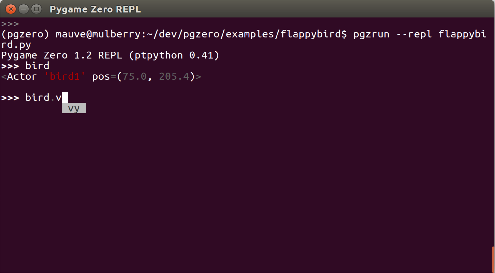

Using the REPL (Read-Evaluate-Print Loop)
=========================================

The REPL allows you to interact with a running Pygame Zero game using Python
commands. As you type it will offer suggestions based on variables that exist
in your program. This can be useful for debugging your game or tuning how difficult it is.

REPL is short for a Read-Evaluate-Print Loop; it means:

1. **Read** a line of code typed by you
2. **Evaluate** the code
3. **Print** the result
4. **Loop** back to step 1!

This is an *optional feature* that may need to :ref:`be installed
<install-repl>` if it was not originally installed with Pygame Zero. If you try
using the REPL, Pygame Zero will let you know if it is not installed.

Running a Pygame Zero program with the REPL
-------------------------------------------

If you normally run your Pygame Zero program using the terminal, add ``--repl``
to the command line when running ``pgzrun``. For example, if your game is in
a file called ``mygame.py``, run::

    pgzrun --repl mygame.py

Using the REPL
--------------

Python code that you type at the REPL is evaluated as if you had typed it into
your game file.

For example, if your game file contains the code ::

    alien = Actor('alien', pos=(54, 60))

    def draw():
        screen.clear()
        alien.draw()

Then at the REPL you could type ``alien`` to see the alien object::

    >>> alien
    <Actor 'alien' pos=(54, 60)>

You can set attributes on the ``alien`` object and see it move::

    >>> alien.x = 90
