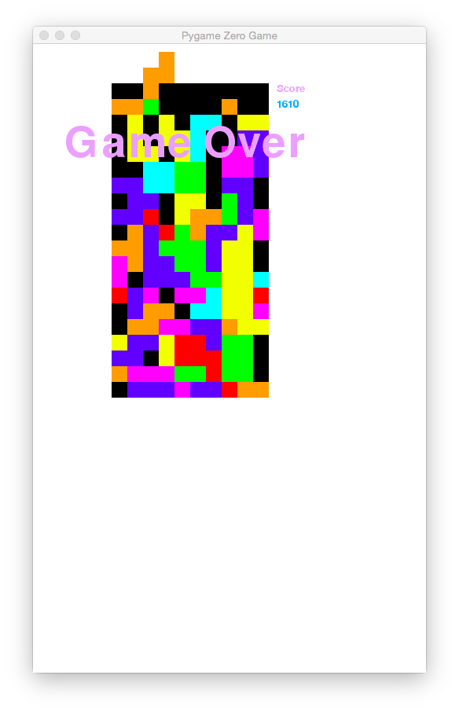

============
Tetra puzzle
============

License
-------
The license details for the code is specified in the beginning of main.py

The license details for the music is specified in the music/HHavok-main.license.txt document

Author
------
David Bern - drobban @ https://github.com/drobban

User controls
-------------
- Key-left = Move active brick left
- Key-right = Move active brick right
- Key-up = Rotates active brick clockwise
- Key-down = Rotates active brick anti clockwise
- Key-space = Moves active brick down at a higher speed
- Key-r = Resets the game
- Key-p = Pauses/Unpauses the game

